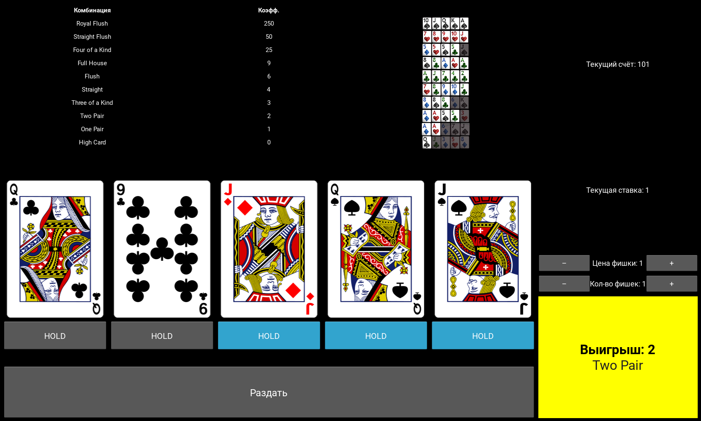

# 🎰 Video Poker (Kivy Edition)

A classic **Video Poker** game built with Python and Kivy.  
Cards, chips, combinations, payout logic — all wrapped in a slick interface with custom graphics and animations.



---

## 🕹 Features

- 🎴 Custom card deck with smooth delayed reveal animation
- 💸 Fully configurable bets (chip value + quantity)
- 📈 Payout table with visual highlighting of winning combos
- 💡 HOLD system with toggles
- 🟨 Blinking row effect on win
- 🎯 Realistic logic for dealing, replacing and evaluating poker hands

---

## 📦 Installation

1. Clone the repo:

```bash
git clone https://github.com/yourname/video-poker-kivy.git
cd video-poker-kivy
```
    Create and activate virtual environment:

python -m venv .venv
source .venv/bin/activate  # or .venv\Scripts\activate on Windows

    Install dependencies:

pip install -r requirements.txt

    Run:

python main.py

🧱 Project Structure

.
├── main.py              # Entry point
├── main_logic.py        # Game logic and mechanics
├── pokergame.kv         # Kivy layout and UI rules
├── dealer.py            # Card dealing and evaluation logic
├── assets/
│   └── combinations/    # Visuals for poker hands
├── cards/               # All card images
└── README.md

🎨 Assets

    Card backs and face cards are custom or from open sources (e.g. Wikimedia, OpenGameArt)

    All assets can be swapped via cards/ folder

🛠 To-Do

Maintaining the deck sequence and dealing from the top cards, not randomly

Replacing the random module with a deterministic and verifiable algorithm

Displaying the deal seed and an interface for checking the deal by seed.

Sound effects for dealing & winning

Touch support optimization for mobile

Save/load balance

Royal flush bonus animation?